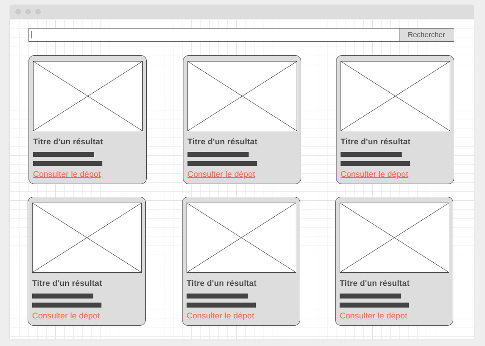

# Moteur de recherche de dépots github avec React

On avait fait un moteur de recherche de dépots github sans React. Et bien ajourd'hui on va le faire avec React

Voici le wireframe

Voici les users stories

- En tant qu'utilisateur je veux voir le résultat d'une recherche pour le terme `react` afin d'avoir du contenu à consulter dès mon arrivé sur l'application
- En tant qu'utilisateur je veux pouvoir valider une nouvelle recherche via un formulaire afin de rechercher des dépots pour n'importe quel mot clé
- En tant qu'utilisateur je veux voir un message et / ou une animation pendant l'attente des résultats afin de comprendre que la recherche est en train de s'effectuer

## Enoncé aventurier

Tout est dit à travers le wireframe et les user stories. A toi de jouer

- Initialise un projet avec Parcel.  
- Modularise au maximum avec React.  
- Utilise l'API Github comme dans l'exercice sans React pour effectuer les recherches.
- Pour le CSS tu es libre de réutiliser les styles précedents ou de les personnaliser, mais concentre toi d'abord sur les fonctionnalités. Si le coeur t'en dit tu peux même tester une bibliothèque de composants comme [Ant Design](https://ant.design/) ou [Material UI](https://mui.com/)

## Enoncé guidé

Si tu veux tu peux aussi suivre les étapes ci dessous

  
Plan d'action

- Initialise un projet avec Parcel
- Installe React et ReactDOM
- Crée l'index html avec la div pour l'app React et la balise script
- Crée ton point d'entrée JS et fais-y le rendu d'un élement React avec ReactDOM
- Décrit ton interface à travers des composants
  - Un composant `App` qui appelle 2 enfants
    - Un composant `Form` pour le formulaire de recherche
    - Un composant `Results` pour la liste des cartes de résultats qui appelle plusieurs fois un composant enfant
      - `Card` pour le détail d'un résultat
- Commence par étoffer de manière statique la structure de chaque composant
- Ajoute des props à ton composant `Card` pour pouvoir configurer le titre, l'image, la description et le lien
- Passe des valeurs en dur à ces props depuis le composant Results pour voir si ça configure bien tes `Card`
- Reprend le fichier de data de l'exercice précédent avec la liste des dépots
- Importe ces data dans le composants App et fait en sorte de passer la liste des dépots en props avec `Results`
- Remplace tes appels à `Card` en dur par une utilisation de `map` dans `Resuls` pour décrire une liste de dépots à partir des data reçues en props
- Initialise un state dans `App` qui représente la liste des dépots
- Intialement la liste doit être vide donc assigne lui un tableau vide
- Passe ce state en props à `Results` à la place de tes data, on doit donc voir une liste vide de résultat pour l'instant
- Pose un `useEffect` dans `App` pour déclencher un effet au rendu initial (donc avec un tableau vide en deuxième argument)
- Dans cet effet déclenche un appel à l'api github pour le terme `react`
- Au retour de l'api modifie ton state pour y ranger la liste des dépots obtenu
- Test, à ce stade tu dois voir les résultats pour React dans ton interface

Prends le temps de fêter ta victoire, la première user story est complété avec brio

Pour la seconde

- Fais en sorte de déclencher un appel à l'api à la soumission du formulaire
- N'oublie pas d'êmpecher la soumission par défaut du formulaire
- Au retour de l'api modifie toujours le même state avec la liste des résultats obtenus
- Test, tu dois voir les résultat de la recherche dans ton interface

Pour la dernière user story

- Initialise un nouveau state dans `App` qui représente l'état de chargement (vrai ou faux)
- Initialise-le à faux
- Dans ta/tes fonctions qui déclenchent un appel à l'api, passe ton state de chargement à `true` avant de lancer les appel à l'api
- Toujours dans ta/tes fonction qui déclenchent un appel à l'api, passe ton state de chargement à `false` après le retour de l'api
- Fais un affichage conditionnel avec l'opérateur `&&` dans tes élements React pour afficher un paragraphe `Veuillez patienter` quand la valeur du state de chargement est vraie

## Aller plus loins

Si tout est ok n'hésite pas customiser le projet